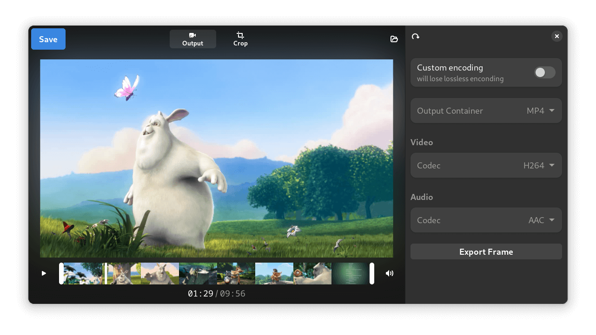

# Moviola

A simple video editor for daily needs

## Basic Features for 1.0

- Crop Videos
- Trim Video start and end
- Export Current Frame
- Rotate
- Flip video
- Remove Audio

## Features to add later

- basic color balance (brightness, contrast, hue, saturation)
- playback speed
- normalized audio
- loseless if only trimming length
- convert to gif
- markup (text and pen)