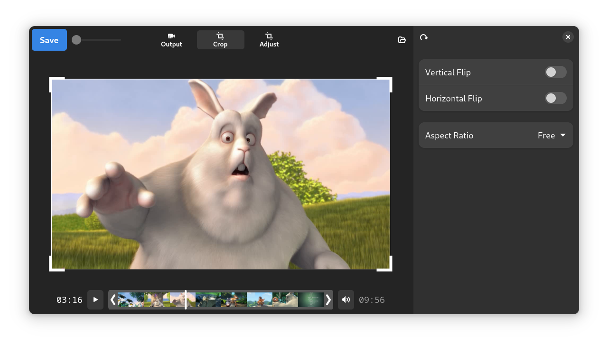

# Moviola

Moviola aims to be a simple-to-use video editor with a pleasing interface.

### Moviola is in pre-alpha and not stable.

## Planned Features
- Crop Videos
- Trim video start and end
- Export current frame
- Rotate
- Flip video
- Remove audio
- Basic colour balance (brightness, contrast, hue, saturation)
- Straighten and Skew
- Loseless encoding when applicable
- Convert to gif
- Text overlay
- Pen markup
- Keyboard shortcuts
- Zoom on preview
